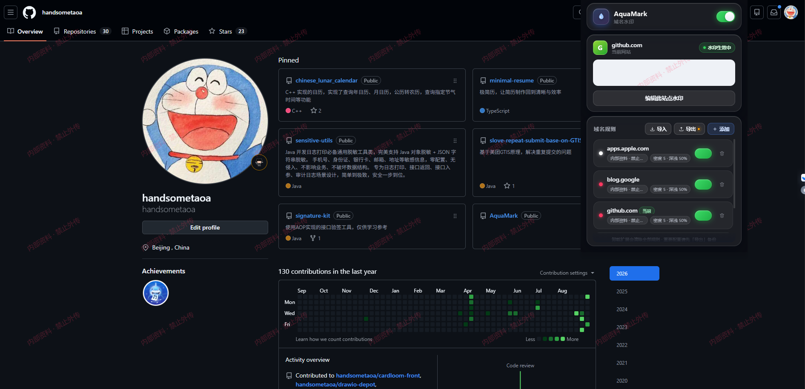
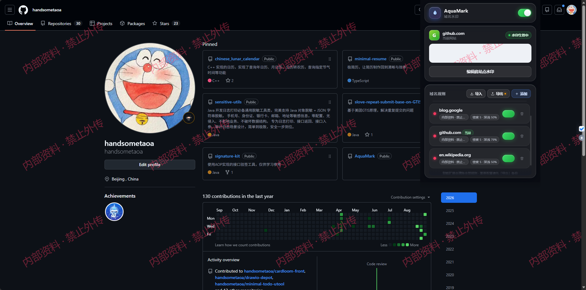

# AquaMark · 域名水印

一个基于 [WXT](https://wxt.dev) 的浏览器扩展：**根据域名动态为网页铺上水印**，防止截图外泄、区分环境。支持自定义水印内容、颜色、深浅、密度、角度与字号，弹窗采用 Apple 风格的毛玻璃设计。


## 📷 界面预览

| 弹窗主界面 | 网页实际水印效果 |
| --- | --- |
|  |  |

> 上图：GitHub 页面铺满「内部资料 · 禁止外传」水印的实际效果

## ✨ 功能

- **按域名动态生效**：添加 `example.com` 即覆盖其所有子域名；多条规则命中时展示列表第一条
- **水印完全可定制**：内容、颜色（8 色板 + 自定义取色）、深浅（1–100%）、密度（1–10 档）、角度（±90°）、字号（10–48px）
- **实时生效**：弹窗里改动任何配置，已打开的网页立即刷新水印，无需刷新页面
- **三态当前站点卡片**：未配置（虚线空预览）/ 水印生效中（完整预览 + 编辑）/ 水印未生效（半透明预览 + 一键启用）
- **实时预览**：编辑抽屉内所见即所得，与页面实际渲染共用同一套贴图生成逻辑
- **数据导入 / 导出**：规则一键备份为 JSON，导入时按域名去重合并、字段自动校验
- **备份提醒**：有改动未导出时，「导出」按钮亮橙色圆点；底部常驻卸载清数据提示
- **总开关 + 工具栏徽标**：一键暂停全部水印；命中规则时工具栏显示 `ON`
- **稳健渲染**：Shadow DOM 隔离 + 最高层级覆盖，不影响页面交互；节点被移除 1.2s 内自愈；SPA 切换域名自动重匹配

## 🎯 使用场景

### 1. 机密 / 敏感数据打水印

内部管理系统、CRM、财务后台、客服工单等页面铺上「内部资料 · 禁止外传」水印。页面被截图外传时，水印可**溯源定位泄露渠道**（不同人员可用不同水印文本，如「研发部-张三」），同时形成心理威慑，降低随手拍屏、截屏转发的概率。

### 2. 生产 / 测试环境区分

给测试环境域名（如 `test.example.com`、`uat.example.com`）加一条醒目的红色「测试环境数据」水印，生产环境保持干净或不加。这样：

- 测试/演示截图一眼可辨，避免被误当成生产数据传播
- 防止把测试截图贴进生产事故单、客户沟通等正式场合
- 测试同学验证环境时无需反复口头确认“这是哪个环境”

### 3. 团队统一水印规范

管理员配置好规则后「导出」JSON，发给团队「导入」，全组水印内容、颜色、深浅即刻统一，无需各自摸索配置。

### 4. 演示 / 培训标注

演示环境、培训材料页面加「仅供演示」水印，防止演示数据被截图另作他用。

## 📥 安装

### Chrome 安装

1. 打开 Chrome，地址栏输入 `chrome://extensions`
2. 打开右上角「**开发者模式**」开关
3. 点击左上角「**加载已解压的扩展程序**」
4. 选择本项目的 `.output/chrome-mv3` 文件夹
5. 工具栏出现蓝色水滴图标（点📌可固定），打开任意网站即可使用

### Edge 安装

1. 打开 Edge，地址栏输入 `edge://extensions`
2. 打开左侧「**开发人员模式**」开关
3. 点击「**加载解压缩的扩展**」
4. 选择本项目的 `.output/chrome-mv3` 文件夹
5. 固定到工具栏即可使用

> 💡 也可以把 `.output/aquamark-1.0.0-chrome.zip` 发给同事，解压后按上述步骤加载。

## 🚀 快速上手

1. 点击工具栏图标打开弹窗，当前网站卡片会显示站点状态
2. 点「**为当前网站添加水印**」→ 填写水印内容、挑颜色、调深浅/密度 → 保存
3. 切回网页，水印已铺满页面；在弹窗里改动会**实时刷新**，无需刷新网页
4. 规则列表里可随时**启用/停用**某条规则、点击行进入编辑、🗑 两次确认删除

## 💾 数据备份与恢复

- **导出**：「域名规则」卡片右上角 ⬇ 导出，得到 `aquamark-rules-日期.json`
- **导入**：⬆ 导入选择 JSON 文件，按域名去重合并（已存在的域名自动跳过）
- **备份提醒**：「导出」按钮亮橙色圆点 = 有改动未备份；熄灭 = 备份是最新的
- ⚠️ **卸载扩展会清除全部规则**，卸载前请先导出备份；重装后导入即可恢复

## 🛠 开发

```bash
npm install        # 安装依赖（自动执行 wxt prepare）
npm run dev        # 开发模式（Chrome，自动打开带扩展的浏览器）
npm run dev:firefox
npm run build      # 生产构建 → .output/chrome-mv3
npm run zip        # 构建并打包 zip（用于商店上传）
npm run compile    # TypeScript 类型检查
npm run icons      # 重新生成应用图标（纯 Node 绘制，无依赖）
npm run preview    # 本地静态服务器预览弹窗 UI（http://localhost:8137/popup.html）
npm run e2e        # 端到端冒烟测试：无头加载扩展，验证水印渲染并截图
```

## 📁 目录结构

```
├── src/
│   ├── entrypoints/
│   │   ├── background.ts      # 工具栏徽标（命中规则显示 ON）
│   │   ├── content.ts         # 内容脚本：水印渲染 + 实时更新 + 自愈
│   │   └── popup/             # 弹窗 UI（玻璃拟态，固定 600px 高）
│   │       ├── index.html
│   │       ├── main.ts        # 入口：初始化与全局事件绑定
│   │       ├── store.ts       # 共享状态
│   │       ├── render.ts      # 三态当前站点卡片 + 规则列表与行交互
│   │       ├── sheet.ts       # 编辑抽屉：表单、色板、实时预览
│   │       ├── io.ts          # 规则导入 / 导出
│   │       ├── ui.ts          # DOM 工具 / Toast / 滑杆填充
│   │       └── style.css
│   └── lib/
│       ├── types.ts           # 类型与默认常量
│       ├── rules.ts           # 域名匹配 / 规则归一化
│       ├── settings.ts        # 存储读写与变更监听（含非扩展环境演示数据）
│       └── watermark.ts       # Canvas 贴图生成（内容脚本与预览共用）
├── scripts/
│   ├── gen-icons.mjs          # 图标生成器（SDF 光栅化 + 手写 PNG 编码）
│   ├── preview.mjs            # 本地静态服务器，预览构建产物
│   └── e2e-test.mjs           # 端到端冒烟测试
├── docs/images/               # README 截图（待放置）
├── public/icon/               # 生成的扩展图标
└── wxt.config.ts
```

## ❓ 常见问题

**Q：水印会影响网页操作吗？**
不会。水印层 `pointer-events: none`，不拦截任何点击、输入、滚动。

**Q：网站把水印层删了怎么办？**
内容脚本每 1.2 秒自检一次，节点被移除会自动重建；页面用 Shadow DOM + 最高层级也无法用普通样式覆盖它。

**Q：换电脑 / 重装后规则怎么恢复？**
卸载会清空数据。只要之前「导出」过 JSON，重装扩展后「导入」该文件即可完整恢复。

**Q：`example.com` 会匹配 `www.example.com` 吗？**
会，所有子域名自动匹配；但不会误伤 `evil-example.com` 这类伪造域名。

## 👤 作者

**handsometaoa** · [GitHub 主页](https://github.com/handsometaoa) · [AquaMark 仓库](https://github.com/handsometaoa/AquaMark) · [问题反馈](https://github.com/handsometaoa/AquaMark/issues)

扩展弹窗底部点「关于」可查看版本号与作者信息。

## 📄 备注

水印为视觉威慑手段，不能阻止专业工具去除；敏感场景请配合权限系统 / DLP 等手段使用。
